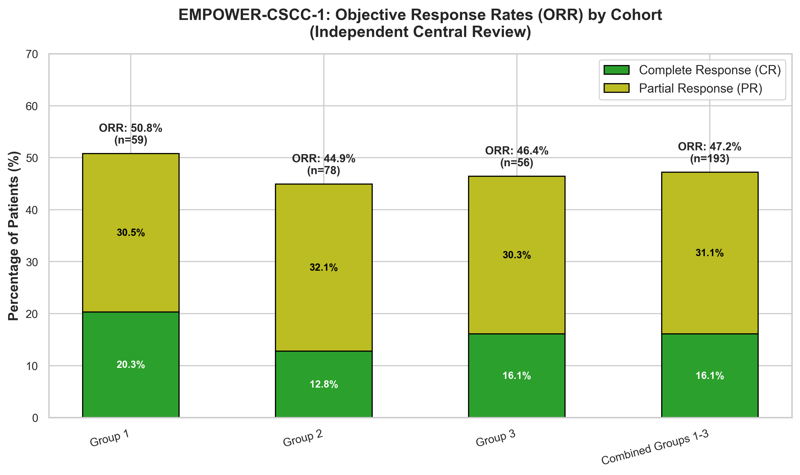
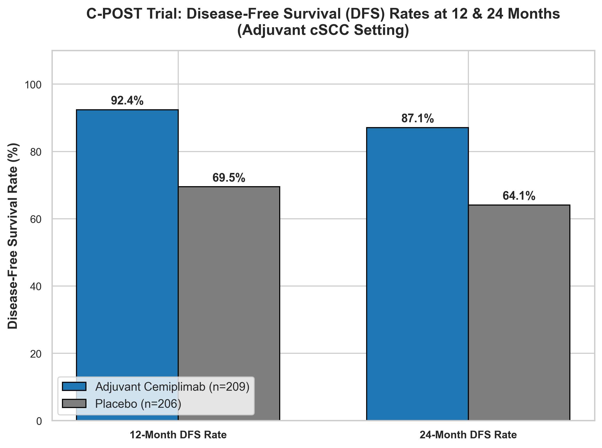
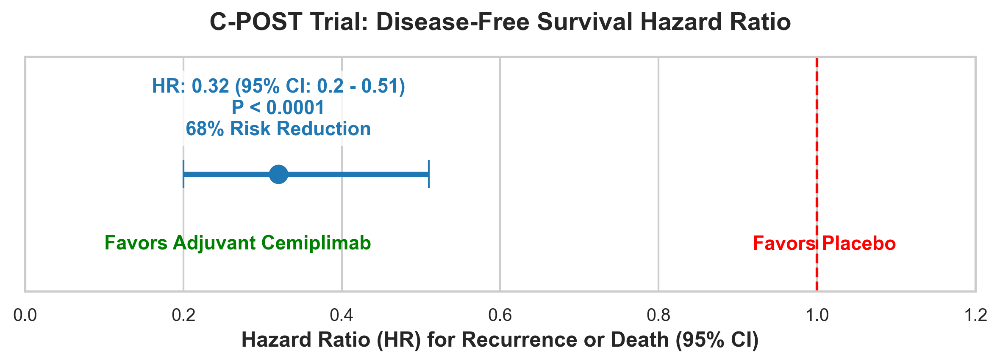

# Comprehensive Analysis of Cemiplimab (Libtayo®) for Advanced & Adjuvant cSCC

Welcome to the open-source pharmaceutical intelligence and computational biology repository for **Cemiplimab (Libtayo®)** in the treatment of Cutaneous Squamous Cell Carcinoma (cSCC).

This project integrates clinical oncology evidence, structural molecular biology, pharmacology, and data science to provide a publication-quality analysis of cemiplimab. All data and figures are generated programmatically and are fully reproducible.

---

## 🔬 Key Research Components

### 1. Mechanism of Action (MoA) & Pharmacology
*   **Target:** Selective blocking of the Programmed Cell Death Protein 1 (PD-1) pathway on T-cells.
*   **Binding Kinetics:** High affinity binding ($K_D \approx 0.60$ nM) with dependency on PD-1 N58 glycosylation.
*   **Molecular Structures:** Structural analyses are documented using PDB coordinate structures [7WVM](https://www.rcsb.org/structure/7WVM) and [8GY5](https://www.rcsb.org/structure/8GY5).
*   **Pharmacokinetics:** Elimination half-life of 20–22 days at steady state, supporting Q3W or Q2W dosing.
*   See [cemiplimab_pharmacology.csv](file:///Users/sohith/Desktop/cemiplimab/data/cemiplimab_pharmacology.csv) for structured parameters.

### 2. Clinical Trial Efficacy
*   **Advanced cSCC (EMPOWER-CSCC-1 / NCT02760498):**
    *   Pooled Objective Response Rate (ORR) of **47.2%** (n=193) with a **16.1%** Complete Response (CR) rate.
    *   Median Progression-Free Survival (PFS) of **26.0 months**.
    *   See [empower_cscc_1_efficacy.csv](file:///Users/sohith/Desktop/cemiplimab/data/empower_cscc_1_efficacy.csv) for cohort breakdowns.
*   **Adjuvant Setting (C-POST / NCT03969004):**
    *   **68% reduction** in the risk of disease recurrence or death (Hazard Ratio = **0.32** [95% CI: 0.20 - 0.51], $P < 0.0001$).
    *   12-Month Disease-Free Survival (DFS) rate of **92.4%** vs 69.5% for placebo.
    *   See [c_post_efficacy.csv](file:///Users/sohith/Desktop/cemiplimab/data/c_post_efficacy.csv) for comparison tables.

---

## 📁 Repository Structure

*   📂 [data/](file:///Users/sohith/Desktop/cemiplimab/data) — Structured CSV files containing curated trial data.
    *   [empower_cscc_1_efficacy.csv](file:///Users/sohith/Desktop/cemiplimab/data/empower_cscc_1_efficacy.csv)
    *   [c_post_efficacy.csv](file:///Users/sohith/Desktop/cemiplimab/data/c_post_efficacy.csv)
    *   [cemiplimab_pharmacology.csv](file:///Users/sohith/Desktop/cemiplimab/data/cemiplimab_pharmacology.csv)
*   📂 [notebooks/](file:///Users/sohith/Desktop/cemiplimab/notebooks) — Executable Jupyter Notebooks for analysis.
    *   [01_clinical_efficacy.ipynb](file:///Users/sohith/Desktop/cemiplimab/notebooks/01_clinical_efficacy.ipynb) — Reproducible figures generation.
*   📂 [docs/](file:///Users/sohith/Desktop/cemiplimab/docs) — Peer-reviewed scientific summaries.
    *   [01_mechanism_and_efficacy.md](file:///Users/sohith/Desktop/cemiplimab/docs/01_mechanism_and_efficacy.md) — MoA and clinical trial review.
*   📂 [figures/](file:///Users/sohith/Desktop/cemiplimab/figures) — Exported publication-quality figures.
    *   [empower_cscc_1_efficacy.png](file:///Users/sohith/Desktop/cemiplimab/figures/empower_cscc_1_efficacy.png)
    *   [c_post_dfs_efficacy.png](file:///Users/sohith/Desktop/cemiplimab/figures/c_post_dfs_efficacy.png)
    *   [c_post_hazard_ratio.png](file:///Users/sohith/Desktop/cemiplimab/figures/c_post_hazard_ratio.png)

---

## 📈 Visualizations Showcase

### EMPOWER-CSCC-1 Response Rates
Grouped bar chart showing objective response rates (ORR) with complete response (CR) and partial response (PR) segmentations for each study cohort.


### C-POST Adjuvant DFS Rates & Hazard Ratio
DFS comparison at 12 and 24 months showing substantial improvement in disease-free outcomes.



---

## 🔬 How to Run the Analyses

1.  **Clone the repository:**
    ```bash
    git clone https://github.com/your-username/cemiplimab.git
    cd cemiplimab
    ```
2.  **Install dependencies:**
    Ensure you have Python 3, Pandas, Matplotlib, and Seaborn installed.
    ```bash
    pip install pandas matplotlib seaborn jupyter
    ```
3.  **Run the notebook:**
    ```bash
    jupyter notebook notebooks/01_clinical_efficacy.ipynb
    ```

---

## 📑 Core Principles
This repository strictly operates under open-source data standards. No patient-level protected information is utilized. All conclusions are drawn from peer-reviewed clinical publications and regulatory documents (FDA, EMA).

For a detailed roadmap of this project, please consult the workspace task tracker [TASKS.md](file:///Users/sohith/Desktop/cemiplimab/TASKS.md).