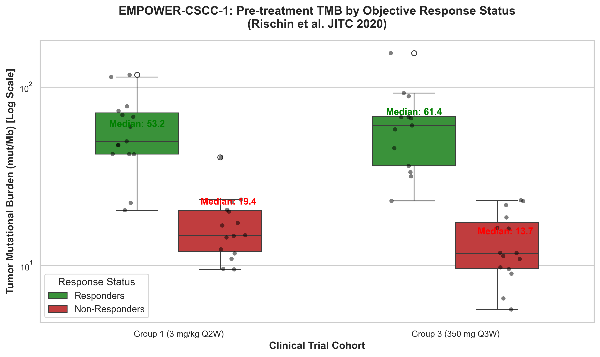
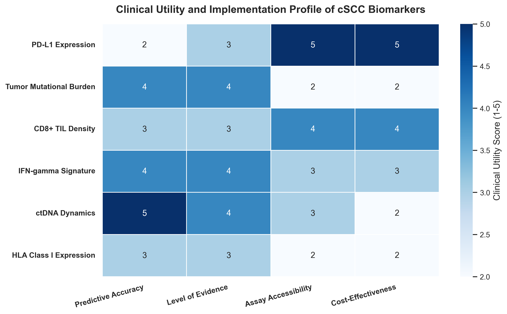
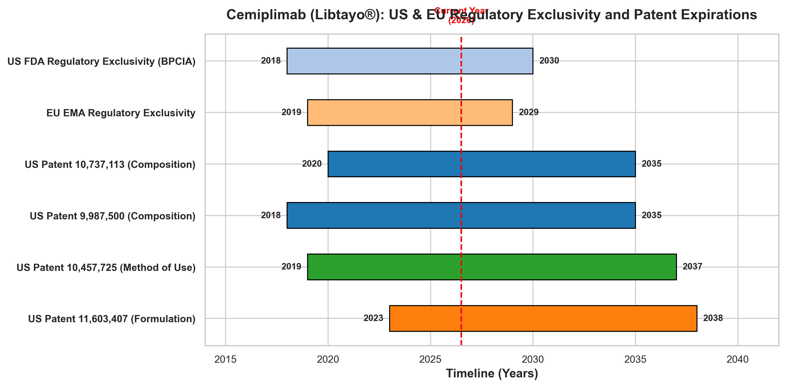
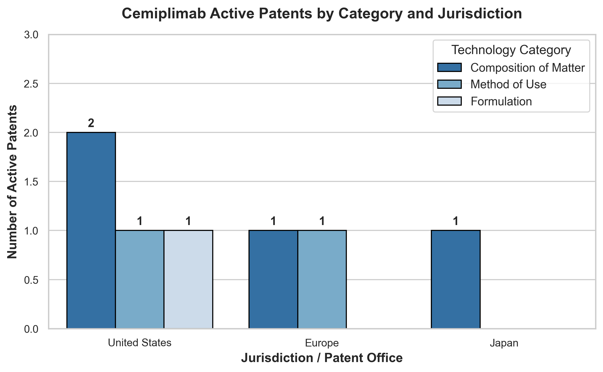
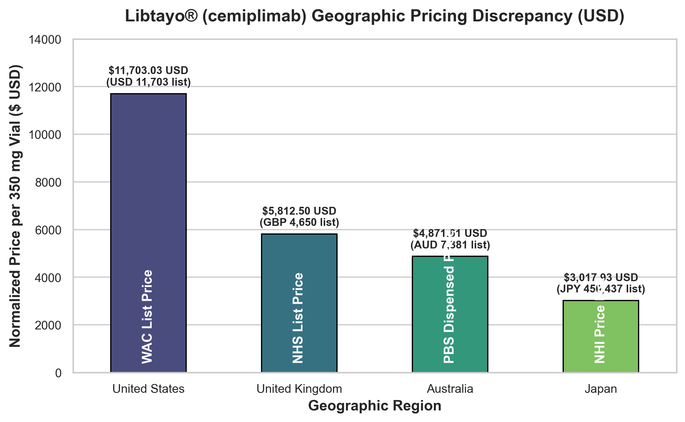
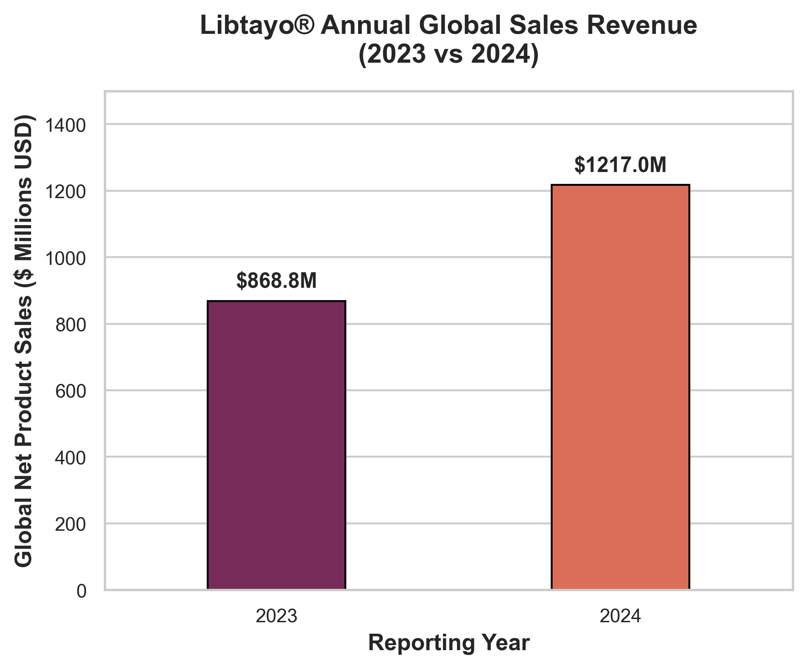
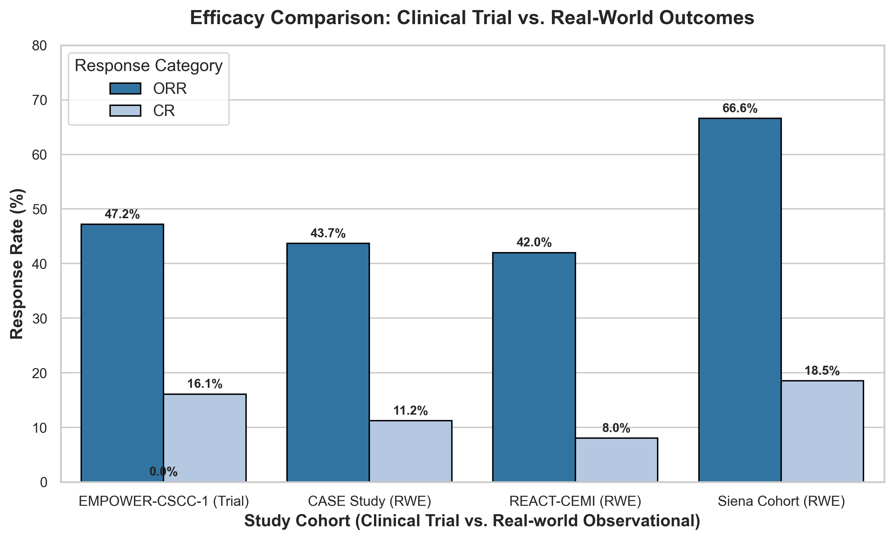
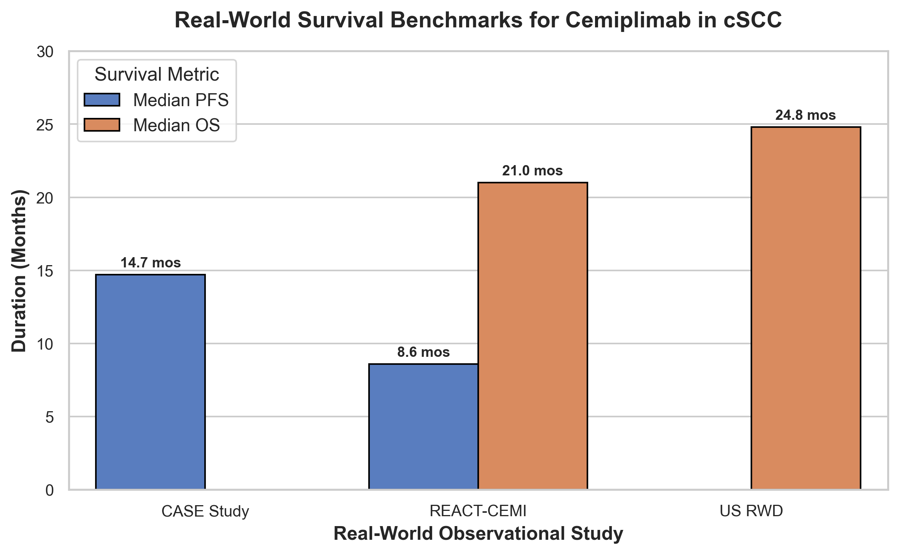

# Comprehensive Analysis of Cemiplimab (Libtayo®) for Advanced & Adjuvant cSCC

Welcome to the open-source pharmaceutical intelligence and computational biology repository for **Cemiplimab (Libtayo®)** in the treatment of Cutaneous Squamous Cell Carcinoma (cSCC).

This project integrates clinical oncology evidence, structural molecular biology, pharmacology, regulatory history, precision oncology biomarkers, intellectual property landscapes, commercial positioning, health economics, and post-launch real-world evidence to provide a publication-quality analysis of cemiplimab. All data and figures are generated programmatically and are fully reproducible.

---

## 🔬 Key Research Components

### 1. Mechanism of Action (MoA) & Pharmacology
*   **Target:** Selective blocking of the Programmed Cell Death Protein 1 (PD-1) pathway on T-cells.
*   **Binding Kinetics:** High affinity binding ($K_D \approx 0.60$ nM) with dependency on PD-1 N58 glycosylation.
*   **Molecular Structures:** Structural analyses are documented using PDB coordinate structures [7WVM](https://www.rcsb.org/structure/7WVM) and [8GY5](https://www.rcsb.org/structure/8GY5).
*   **Pharmacokinetics:** Elimination half-life of 20–22 days at steady state, supporting Q3W or Q2W dosing.
*   See [cemiplimab_pharmacology.csv](file:///Users/sohith/Desktop/cemiplimab/data/cemiplimab_pharmacology.csv) for structured parameters.

### 2. Clinical Trial Efficacy
*   **Advanced cSCC (EMPOWER-CSCC-1 / NCT02760498):**
    *   Pooled Objective Response Rate (ORR) of **47.2%** (n=193) with a **16.1%** Complete Response (CR) rate.
    *   Median Progression-Free Survival (PFS) of **26.0 months**.
    *   See [empower_cscc_1_efficacy.csv](file:///Users/sohith/Desktop/cemiplimab/data/empower_cscc_1_efficacy.csv) for cohort breakdowns.
*   **Adjuvant Setting (C-POST / NCT03969004):**
    *   **68% reduction** in the risk of disease recurrence or death (Hazard Ratio = **0.32** [95% CI: 0.20 - 0.51], $P < 0.0001$).
    *   12-Month Disease-Free Survival (DFS) rate of **92.4%** vs 69.5% for placebo.
    *   See [c_post_efficacy.csv](file:///Users/sohith/Desktop/cemiplimab/data/c_post_efficacy.csv) for comparison tables.

### 3. Clinical Development & Subgroup Efficacy
*   **Consistent Subgroup Efficacy:** Efficacy is maintained in elderly populations, which is vital given the demographics of skin cancer. ORR is **44.9%** in patients $\ge$ 75 years, compared to **53.0%** in patients 65–75, and **42.9%** in patients <65.
*   **ECOG Status:** Efficacy remains high in both ECOG PS 0 (**48.4%**) and ECOG PS 1 (**46.1%**) patients.
*   See [empower_cscc_1_subgroups.csv](file:///Users/sohith/Desktop/cemiplimab/data/empower_cscc_1_subgroups.csv) for complete subgroup data.

### 4. Safety Profile & Tolerability
*   **Tolerability:** Cemiplimab is well-tolerated, with a discontinuation rate due to toxicities of **9.8%** in the adjuvant setting.
*   **Common Toxicities:** Low rates of severe Grade 3–4 adverse events (e.g., Fatigue 1.2% in adjuvant cemiplimab vs 0.5% in placebo).
*   **Immune-Related AEs (irAEs):** Endocrine toxicities like Hypothyroidism occur in 10% of adjuvant patients.
*   See [cemiplimab_safety_ae_profile.csv](file:///Users/sohith/Desktop/cemiplimab/data/cemiplimab_safety_ae_profile.csv) for full AE details.

### 5. Regulatory Evolution & History
*   **Approved Indications:** Approvals span advanced cSCC (2018), advanced Basal Cell Carcinoma (2021), advanced NSCLC (2021/2022), and adjuvant high-risk cSCC (2025).
*   **Regulatory Programs:** Leveraged FDA's breakthrough therapy status, priority review, and the Real-Time Oncology Review (RTOR) pilot program.
*   See [cemiplimab_regulatory_history.csv](file:///Users/sohith/Desktop/cemiplimab/data/cemiplimab_regulatory_history.csv) for the timeline.

### 6. Biomarkers & Precision Medicine
*   **PD-L1 Status:** Clinically responses occur in both PD-L1-positive and PD-L1-negative tumors; it is not a mandatory selection biomarker.
*   **Tumor Mutational Burden (TMB):** cSCC has one of the highest TMBs (~50 mut/Mb median) due to Signature 7 (UV radiation). High TMB correlates with clinical benefit, with responders showing higher median TMB (~53-61 mut/Mb) vs non-responders (~13-19 mut/Mb) in EMPOWER-CSCC-1.
*   **Tumor Immune Microenvironment (TIME):** Active infiltration of CD8+ TILs and conventional dendritic cells (cDC1) alongside upregulated IFN-$\gamma$ signatures are key drivers of therapy success, whereas HLA Class I loss or JAK1/2 mutations drive acquired resistance.
*   See the [biomarker/](file:///Users/sohith/Desktop/cemiplimab/biomarker) directory for detailed biomarker datasets and markdown reports.

### 7. Intellectual Property & Exclusivity
*   **Licensing & restructurings:** In 2022, Regeneron bought out Sanofi's global stake for $900 million upfront, paying an 11% global sales royalty.
*   **Patent Landscape:** Key US patents cover antibody composition (expirations in 2035), method-of-use (2037), and formulations (2038). Parallel coverage exists in the EU and Japan.
*   **Regulatory Exclusivity:** Baseline regulatory protection runs to 2030 in the US (BPCIA 12 years) and 2029 in the EU (EMA 10 years).
*   **Biosimilars:** No biosimilars are currently in active clinical development or approved for cemiplimab.
*   See the [IP/](file:///Users/sohith/Desktop/cemiplimab/IP) directory for patent databases and licensing reports.

### 8. Commercial Landscape & Market Positioning
*   **Commercial Performance:** Global net sales of Libtayo reached **$868.8 million** in 2023 and **$1.217 billion** in 2024 (a **40.1% year-on-year growth**), following Regeneron's buyout of global commercialization rights.
*   **Competitive Landscape:** Outperforms traditional chemotherapies (ORR 30-50%, short PFS) and EGFR inhibitors (ORR 28%, severe rash). Offers higher Complete Response rates (16.1% CR) compared to pembrolizumab (~6% CR).
*   **Guidelines Recommendations:** Listed as a preferred first-line systemic treatment (Category 2A preferred) in NCCN and ESMO clinical practice guidelines.
*   See the [commercial/](file:///Users/sohith/Desktop/cemiplimab/commercial) directory for commercial summaries and competitor datasets.

### 9. Financial Analysis & Market Economics
*   **Geographic Pricing:** US Wholesale Acquisition Cost (WAC) is **$11,703.03** per 350 mg vial. UK List price is **£4,650**, Australia PBS dispensed price is **$7,381.23 AUD**, and Japan NHI price is **450,437 JPY**. A 1-year adjuvant course (17 cycles) list price varies from $51k (Japan) to $198k (US WAC).
*   **Reimbursement Status:** Reimbursed globally under single-payer systems (NICE routine NHS commissioning, Australia PBS S100, Canada CADTH) with clinical criteria restricting use to patients ineligible for surgery/radiation.
*   **Health Economics:** Cost-effective in partitioned survival models (lifetime horizon). US ICER is **$99,024 per QALY gained** vs. chemotherapy, and Italy ICUR is **€34,110/QALY**, both well within established WTP thresholds.
*   See the [financial/](file:///Users/sohith/Desktop/cemiplimab/financial) directory for detailed pricing databases and health economics models.

### 10. Post-launch Evidence & Real-world Outcomes
*   **Real-world Cohorts:** Large-scale registries (CASE, n=254; UK REACT-CEMI, n=105; US EHR Database, n=622) validate clinical trial efficacy, showing real-world ORR of **42% to 44%** and median overall survival of **21 to 25 months**.
*   **Special Populations:** Reaffirms efficacy in patients $\ge$ 75 years and supports graft-sparing management in Solid Organ Transplant Recipients (SOTRs) facing a 30-40% allograft rejection risk.
*   **Pharmacovigilance:** Disproportionality analysis of FAERS data identifies rare, serious post-market safety signals such as immune-mediated myocarditis and Stevens-Johnson Syndrome (SJS).
*   **Future Pipelines:** High neoadjuvant pathologic complete response (pCR) rate of **50.6%** (Gross 2022 NEJM) shows promise in sparing patients from disfiguring surgeries, while the cemiplimab-fianlimab (anti-LAG-3) co-formulation targets PD-1 resistant cohorts.
*   See the [post_launch/](file:///Users/sohith/Desktop/cemiplimab/post_launch) directory for RWE databases and pharmacovigilance reports.

---

## 📁 Repository Structure

*   📂 [data/](file:///Users/sohith/Desktop/cemiplimab/data) — Curated clinical and pharmacological datasets.
*   📂 [biomarker/](file:///Users/sohith/Desktop/cemiplimab/biomarker) — Biomarker reports, dataset, and notebook.
*   📂 [IP/](file:///Users/sohith/Desktop/cemiplimab/IP) — Patent databases and timeline notebook.
*   📂 [commercial/](file:///Users/sohith/Desktop/cemiplimab/commercial) — Commercial strategy, competitor datasets, and guidelines.
*   📂 [financial/](file:///Users/sohith/Desktop/cemiplimab/financial) — Pricing, revenue, and health economics models.
*   📂 [post_launch/](file:///Users/sohith/Desktop/cemiplimab/post_launch) — Real-world evidence databases, safety registries, guideline updates, and future clinical directions.
    *   [post_launch_summary.csv](file:///Users/sohith/Desktop/cemiplimab/post_launch/post_launch_summary.csv)
    *   [post_launch_analysis.ipynb](file:///Users/sohith/Desktop/cemiplimab/post_launch/post_launch_analysis.ipynb)
    *   [real_world_evidence.md](file:///Users/sohith/Desktop/cemiplimab/post_launch/real_world_evidence.md)
    *   [long_term_safety.md](file:///Users/sohith/Desktop/cemiplimab/post_launch/long_term_safety.md)
    *   [pharmacovigilance.md](file:///Users/sohith/Desktop/cemiplimab/post_launch/pharmacovigilance.md)
    *   [adoption.md](file:///Users/sohith/Desktop/cemiplimab/post_launch/adoption.md)
    *   [guideline_updates.md](file:///Users/sohith/Desktop/cemiplimab/post_launch/guideline_updates.md)
    *   [future_directions.md](file:///Users/sohith/Desktop/cemiplimab/post_launch/future_directions.md)
*   📂 [notebooks/](file:///Users/sohith/Desktop/cemiplimab/notebooks) — Clinical efficacy and safety analysis notebooks.
*   📂 [docs/](file:///Users/sohith/Desktop/cemiplimab/docs) — Peer-reviewed scientific summaries.
*   📂 [figures/](file:///Users/sohith/Desktop/cemiplimab/figures) — Exported publication-quality figures.
    *   [rwe_vs_clinical_trial.png](file:///Users/sohith/Desktop/cemiplimab/figures/rwe_vs_clinical_trial.png)
    *   [rwe_survival_benchmarks.png](file:///Users/sohith/Desktop/cemiplimab/figures/rwe_survival_benchmarks.png)

---

## 📈 Visualizations Showcase

### Clinical Efficacy & Safety Profile


### Biomarkers & Precision Medicine



### Intellectual Property & Exclusivity



### Commercial Landscape & Market Positioning


### Financial Analysis & Market Economics



### Post-launch Evidence & Real-world Outcomes
Comparing clinical trials to RWE cohorts, and illustrating RWE survival benchmarks.



---

## 🔬 How to Run the Analyses

1.  **Clone the repository:**
    ```bash
    git clone https://github.com/your-username/cemiplimab.git
    cd cemiplimab
    ```
2.  **Install dependencies:**
    Ensure you have Python 3, Pandas, Matplotlib, and Seaborn installed.
    ```bash
    pip install pandas matplotlib seaborn jupyter
    ```
3.  **Run the notebooks:**
    ```bash
    jupyter notebook notebooks/01_clinical_efficacy.ipynb
    jupyter notebook notebooks/02_regulatory_safety.ipynb
    jupyter notebook biomarker/biomarker_analysis.ipynb
    jupyter notebook IP/patent_timeline.ipynb
    jupyter notebook commercial/commercial_analysis.ipynb
    jupyter notebook financial/financial_analysis.ipynb
    jupyter notebook post_launch/post_launch_analysis.ipynb
    ```

---

## 📑 Core Principles
This repository strictly operates under open-source data standards. No patient-level protected information is utilized. All conclusions are drawn from peer-reviewed clinical publications and regulatory documents (FDA, EMA).

For a detailed roadmap of this project, please consult the workspace task tracker [TASKS.md](file:///Users/sohith/Desktop/cemiplimab/TASKS.md).