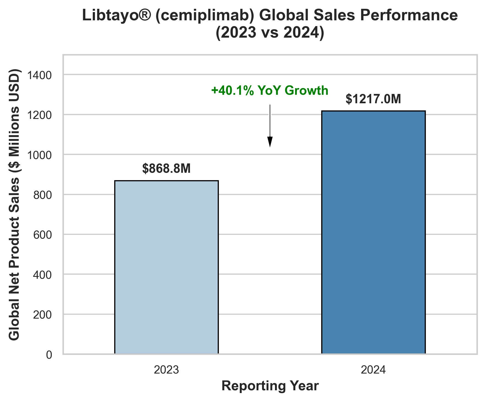
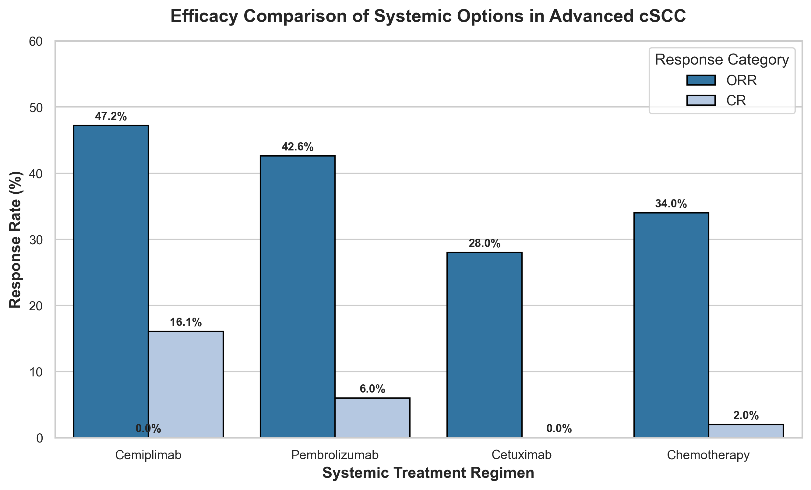

# Phase 5: Commercial Landscape & Market Positioning of Cemiplimab

## Introduction
Securing clinical data is only half the battle; successfully commercializing a drug requires strategic positioning in the market. In this post, we analyze cemiplimab’s (Libtayo®) commercial strategy, competitor landscape, and its integration into global oncology guidelines.

---

## 1. Corporate Strategy: Consolidating Control
*   **Restructuring:** In July 2022, Regeneron restructured its oncology collaboration with Sanofi, buying out Sanofi's global stake for **$900 million upfront** and an **11% royalty** on global net sales.
*   **Consolidation:** This buyout consolidated commercial control under Regeneron, improving operating margins and allowing for unified global marketing efforts.

---

## 2. Competitive Landscape: First-Mover Advantage
*   **The Competitors:** Cemiplimab was the first immunotherapy approved for advanced cSCC (2018). Its main competitor, pembrolizumab (Keytruda®), received approval later in 2020.
*   **The Edge:** Cemiplimab maintains a strong clinical edge:
    *   **Higher Complete Response (CR) Rate:** Achieved a **16.1%** pooled CR rate in trials compared to pembrolizumab's ~6% CR rate.
    *   **Efficacy in Locally Advanced disease:** Cemiplimab showed robust responses in locally advanced cases, whereas competitor data focused heavily on metastatic patients.

---

## 3. Treatment Guidelines Integration
The commercial success of Libtayo has been supported by recommendations from clinical guideline bodies:
*   **NCCN Guidelines:** Listed cemiplimab as a **preferred first-line systemic treatment (Category 2A preferred)** for advanced cSCC.
*   **ESMO Guidelines:** Recommends anti-PD-1 monotherapy as the standard of care, relegating traditional toxic chemotherapies and EGFR inhibitors (such as cetuximab) to second-line or supportive roles.

---

## Conclusion
Unified corporate control, first-mover advantage, and preferred status in clinical guidelines have secured cemiplimab’s leadership position in the advanced cSCC market.

For full datasets, refer to [commercial_summary.csv](file:///Users/sohith/Desktop/cemiplimab/commercial/commercial_summary.csv).
