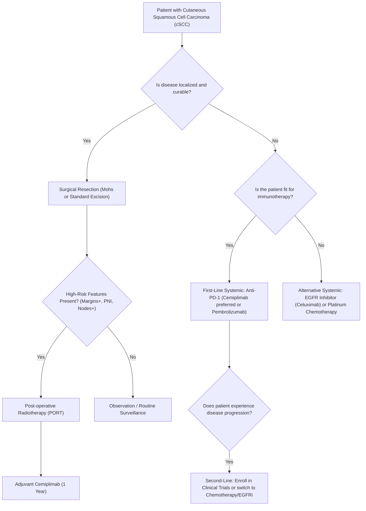

# Clinical Treatment Guidelines and Algorithms in cSCC

## 1. Background
Clinical practice guidelines represent the consensus of oncology experts and determine physician prescribing patterns, hospital formularies, and insurance reimbursement. The inclusion of cemiplimab as a preferred systemic agent in major guidelines has been a primary driver of its commercial success. This document reviews the recommendations from the National Comprehensive Cancer Network (NCCN) and the European Society for Medical Oncology (ESMO).

---

## 2. Guideline Recommendations

### 2.1 National Comprehensive Cancer Network (NCCN) Guidelines
The NCCN Guidelines for Squamous Cell Skin Cancer recommend:
*   **Preferred Systemic Therapy:** **Cemiplimab-rwlc** or **Pembrolizumab** are classified as **Category 2A preferred systemic therapies** for patients with locally advanced, recurrent, or metastatic cSCC who are not candidates for curative surgery or curative radiation.
*   **Adjuvant Setting:** In patients with high-risk resected cSCC (e.g., perineural invasion, positive margins) who have undergone definitive surgical resection and local radiation, adjuvant cemiplimab is recommended as a preferred option (following its 2025 FDA approval).
*   **Other Systemic Options:** EGFR inhibitors (e.g., cetuximab) or platinum-based chemotherapy are listed as Category 2A options, but are explicitly designated for patients who are not candidates for immunotherapy or who have progressed on anti-PD-1 agents.

### 2.2 ESMO and European Interdisciplinary Guidelines
*   **First-Line Recommendation:** Cemiplimab is recommended as the **first-line standard of care** for patients with advanced (metastatic or locally advanced) cSCC who are ineligible for surgery or radiotherapy.
*   **Consensus:** Joint guidelines from the European Association of Dermato-Oncology (EADO), European Dermatology Forum (EDF), and European Organisation for Research and Treatment of Cancer (EORTC) recommend anti-PD-1 immunotherapy as the preferred systemic option.

---

## 3. Clinical Treatment Algorithm in cSCC

The standard therapeutic pathway for cSCC is structured as follows:

---

## 4. References
1.  **National Comprehensive Cancer Network (NCCN).** (2025). "NCCN Clinical Practice Guidelines in Oncology: Squamous Cell Skin Cancer (Version 1.2025)." [NCCN Guidelines](https://www.nccn.org)
2.  **Stratigos, A. J., et al.** (2020). "Diagnosis and treatment of cutaneous squamous cell carcinoma. European consensus-based interdisciplinary guidelines: Update 2020." *European Journal of Cancer*, 148, 120-137. PMID: [33774311](https://pubmed.ncbi.nlm.nih.gov/33774311) | DOI: [10.1016/j.ejca.2021.01.047](https://doi.org/10.1016/j.ejca.2021.01.047)
